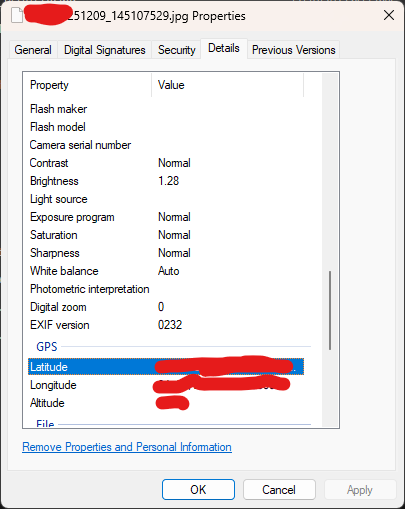
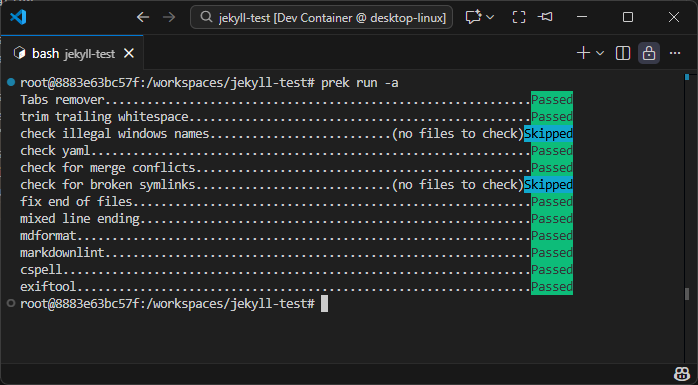

<!-- cspell: ignore exif exiftool -->

## the problem

One cool/creepy thing about modern cameras and phones is that they can embed a lot of "[exif](https://en.wikipedia.org/wiki/Exif)" metadata into an image, such as what kind of camera and lense was used, how far away the object was, and the exact GPS coordinates of where the picture was taken.



However, when posting stuff online, such as a blog, or uploading files to github, you probably don't want to inadvertently leak too much personal information.

There's a great software called [exiftool](https://exiftool.org/) that gives you a commandline interface to edit or remove this data.

There's another great tool called [prek](https://github.com/j178/prek), (and its predecessor [pre-commit](https://pre-commit.com/)) - it's a framework that lets you run various checks and formatters to prevent you from adding files to git under certain conditions, or take some automated action before doing so. The great thing about prek is that it manages all the other tools for you via a single config file, and installs them in a repeatable, sand-boxed environment, and the same config can be used in CI. I use this a ton in all my projects to automate all kinds of things.

You can manually run all the checks like this. Or it runs the appropriate checks based on filetype when committing.



## the solution

For a tool to be used by prek, it needs to have a .pre-commit-hooks.yaml config file in the project. So I created a fork of exiftool with this config and got it [merged](https://github.com/exiftool/exiftool/pull/366) back to the main repo. Now I, and anyone else, can now add a few lines of yaml to their git projects to automatically strip away exif data whenever they commit images to a git repo.

<!-- grab the lines in .pre-commit-config.yaml from exiftool to the next repo -->

```yaml
# .pre-commit-config.yaml
repos:

```

<span style="color: red">Disclaimer: if you commit and push sensitive files or data to github, even if you go back and delete it, force-push, etc, it might still be discoverable somehow.</span> That's why it's so important to prevent these kinds of things in the first place.
