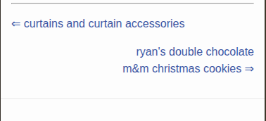

Found a somewhat-recent ([2024](https://developer.mozilla.org/en-US/docs/Web/CSS/Reference/Properties/text-wrap)) nice little CSS feature for balanced text-wrapping.

I am by no means a CSS expert. I know just enough to have an idea of what _should_ be possible, and drive myself insane trying to figure out how to do it.

I was working on adding next/previous post links to the bottom of the blog post layout, and I came across this feature which I think makes it look a lot nicer.

The next-post link is right aligned with a little right-arrow ⇒ after the title. If the screen is shrunken just right, then the arrow ends up on its own line, which looks ugly. This tries to balance the number of characters per line. It's apparently computationally more intensive for browsers and limited to a handful of lines. But this is exactly the use case I imagine it would be for

## examples

some quick inline CSS examples

### without `text-wrap: balance;`

<code id="example1-code"></code>

a long titled link to the next post &rArr;

### with `text-wrap: balance;`

<code id="example2-code"></code>

a long titled link to the next post &rArr;

<noscript>need javascript enabled to populate the example code.</noscript>

## conclusion

Here's a screenshot from the blog on a simulated Iphone SE:

Or see it action by scrolling to the bottom of this page and making the window smaller.
