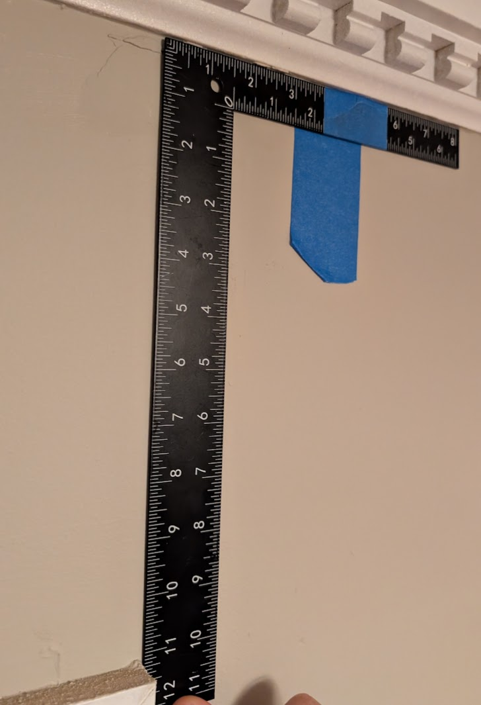
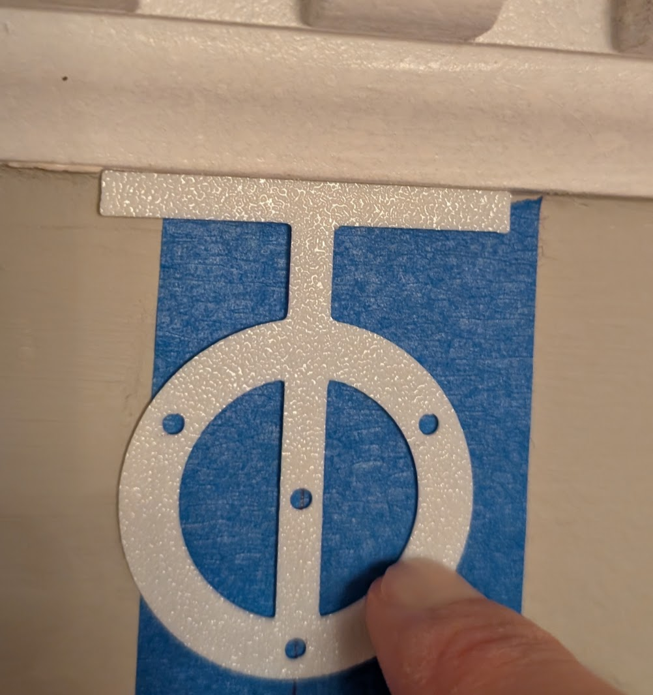
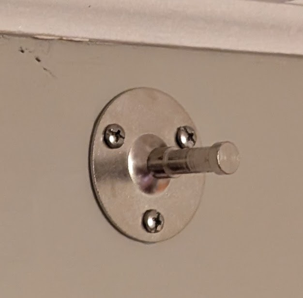
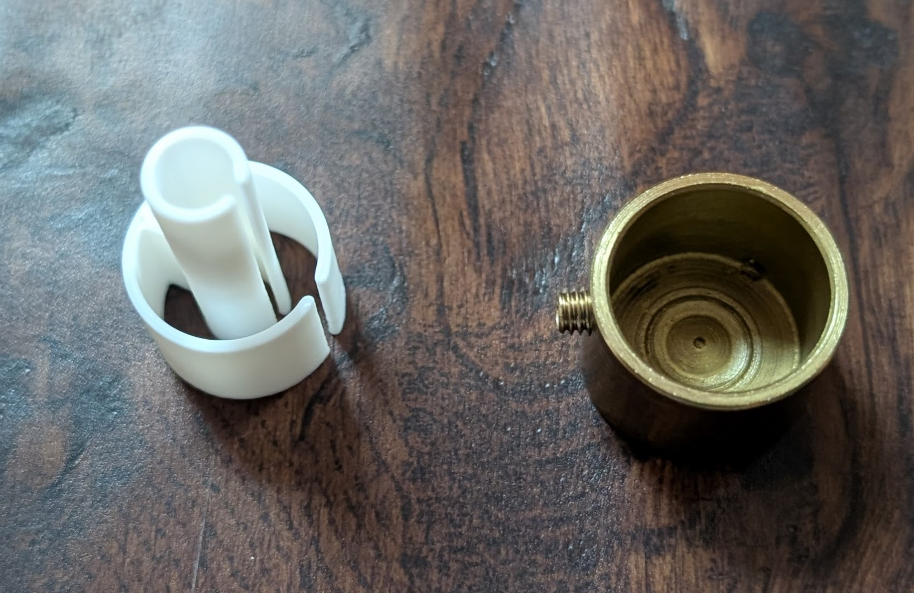
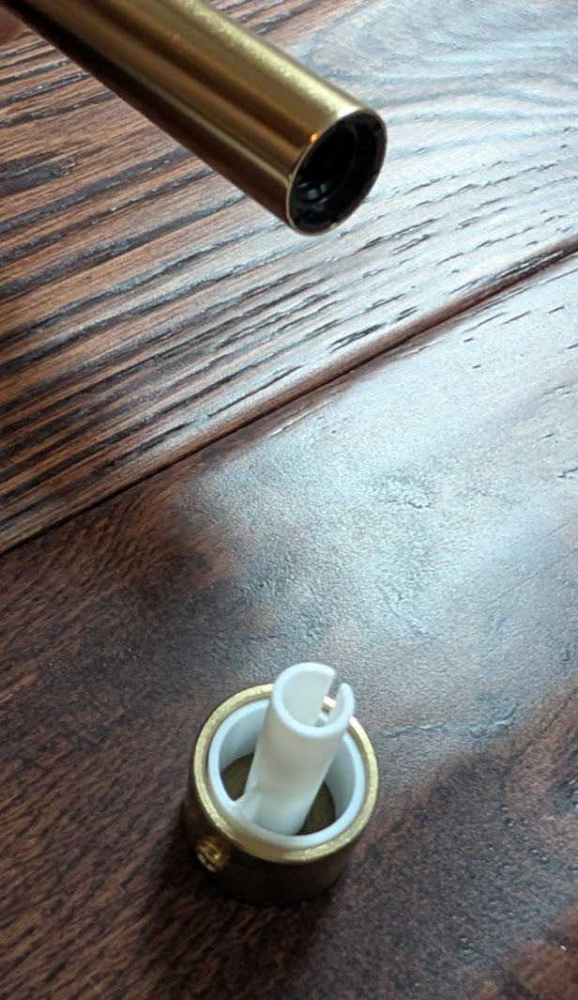
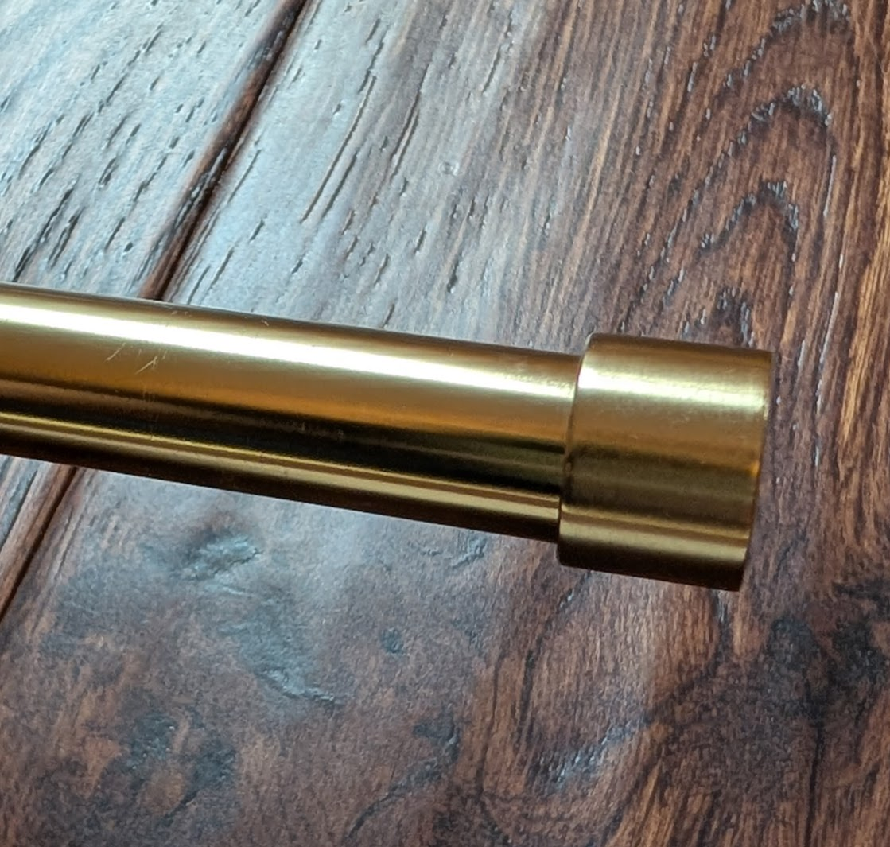
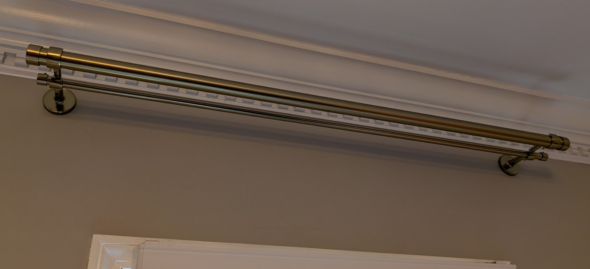

We've been installing a lot of curtains and I've gotten it down to a science. And of course I had to get 3d-printing involved somehow.

First life-hack: **put tape on your ruler or carpenter's square**. Then you don't have to worry about finding the exact right line while you're standing on top of a ladder, just look for the edge of the tape. And then you can flip it over and line up with that same tape, even though the units on the other side might be different...

## stencils

The ruler gives us the lateral location of the center of the bracket, but the bracket itself has a specific hole pattern. Grabbed the calipers and made a quick sketch of the bracket holes, plus a top bar with the desired vertical spacing from the trim:

Printed a thin stencil and it worked great!

## extenders

The problem with adjustable curtain rods is that they're made up of multiple overlapping tubes of slightly different diameters, and the curtain rings don't glide well over the bumps where the tubes come together. So a fixed-length rod is ideal.

However, the rod we wanted was just a tad too short; it could have worked but would leave very little room for the end caps and not look too nice. So I was able to 3d-print some extenders that would allow the end-caps to hang just off the edge of the rods, effectively giving us another inch.

Rather than fussing with perfect sizing, I just made them compressible and springy so they could press fit right into the caps and the threaded holes on the end of the rods.

The inner peg tapers out slightly, so it will be a snug fit.

Finished!

