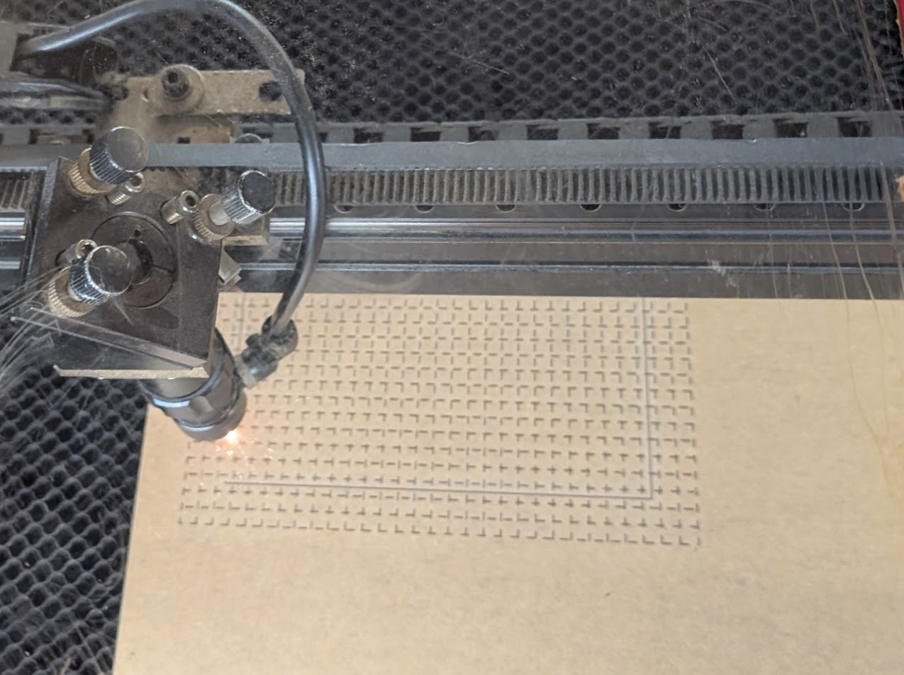
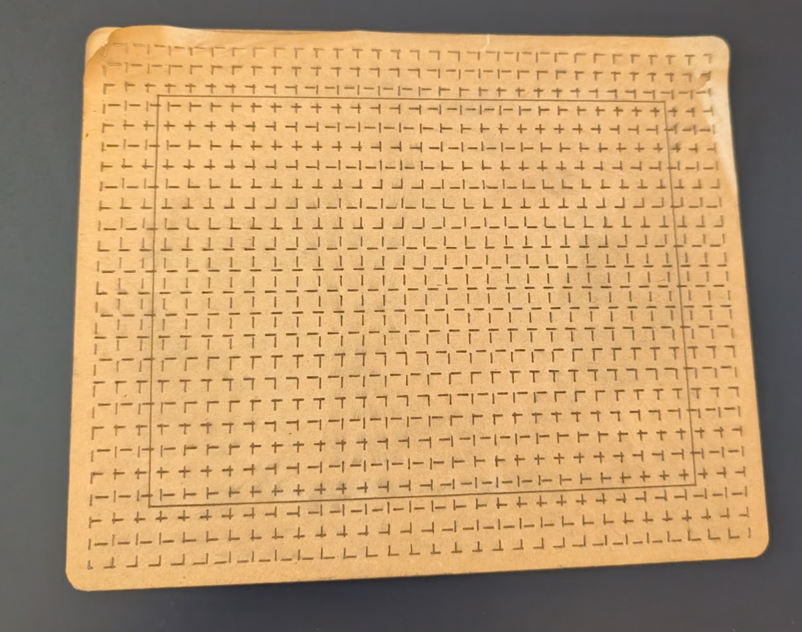
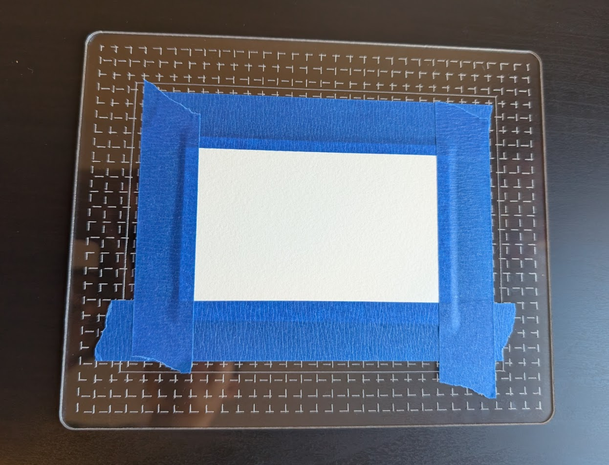
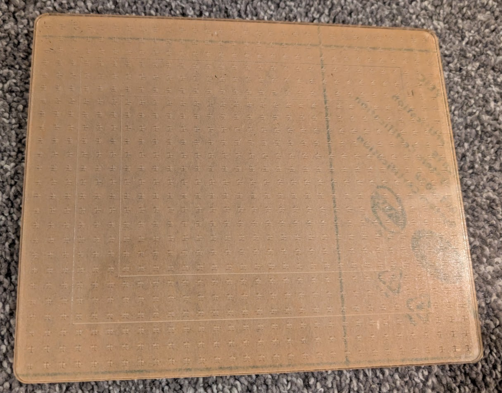

My wife likes to paint watercolor pictures using certain small sizes of paper, so as a Christmas gift, I made some custom laser-engraved acrylic panels to use as desktop easel surfaces.

## the goal

She uses a handful of different specific sizes of paper, and tapes them down to a flat surface with painter's tape. The tape needs to be well levelled and centered, so that the paintings have a nice border afterwards.

She's been using cardboard, but it gets wet and warps, so we wanted something that would stay flat. I also wanted to add special markings to help with the alignment - some boxes that match the paper sizes, and some general grid-lines for lining up the tape and providing flexibility to be used with other sizes.

## first draft

I quickly sketched up a basic rectangle with rounded corners and some patterned grid-lines in fusion360 and exported to svg, then manually edited the svg to have the borders be a different color than the grid-lines, so I could differentiate cutting and engraving in LightBurn.

I realized there would be a problem... Acrylic plates come with some protective adhesive on them to be peeled off after cutting, and this would have meant peeling off hundreds of tiny squares. It's frustrating to peel off even one solid piece of this film - I don't recommend it.

So I decided to just use the perforation mode in LightBurn to make the grid-lines dashed. They were 1/4" apart, and the setting was in mm so I lazily did 3mm (approximately but not quite 1/8").

Thankfully the it was easy enough to peel the film off mostly in one piece.

This approximation made it look a little funny since it was staggered, but the result was pretty good and definitely usable!

## better lines

I wanted to make the grid-lines look nicer, so I did an actual "+" shape and patterned that across the whole surface. But then I ran into an issue... Every time I tried to export it to svg from fusion using the shaper-origin plugin, it would crash. I think it was just too many lines... rather than `m+n`, it was `2*m*n`.

Instead. I just exported a sketch with a single "+" symbol, and had to tinker around with the svg file to figure out the placement and units. Then I converted it to a jinja template and just used simple for-loops to manually pattern the "+" shape.

The svg template file and the command to generate it are in a little repo [here](https://github.com/r-downing/paintboard)

The final product looks much nicer!

