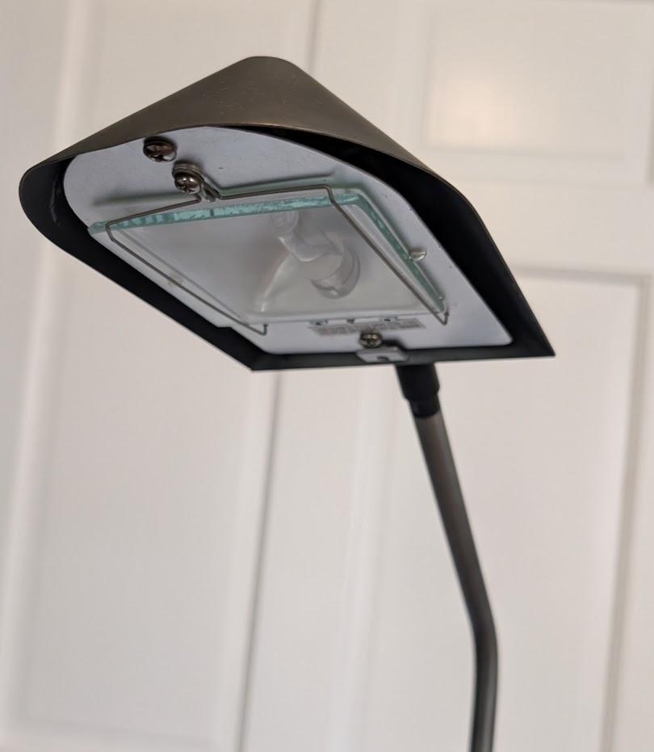
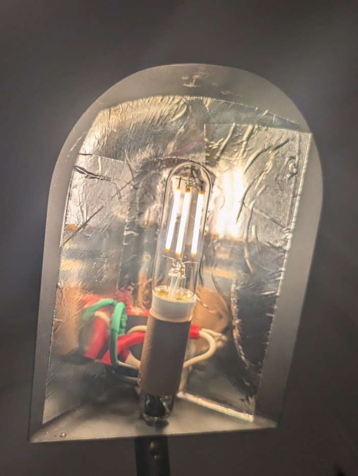
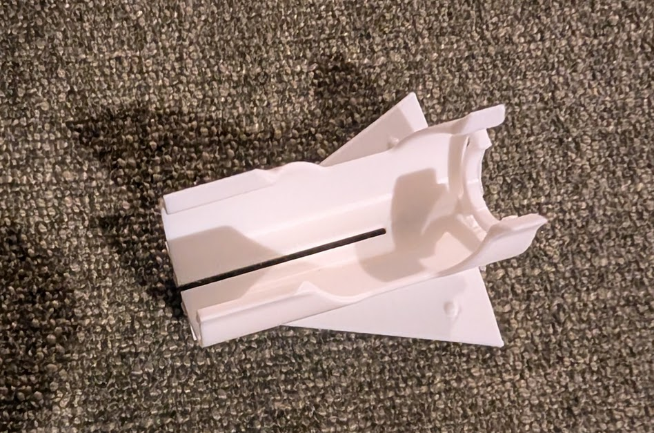
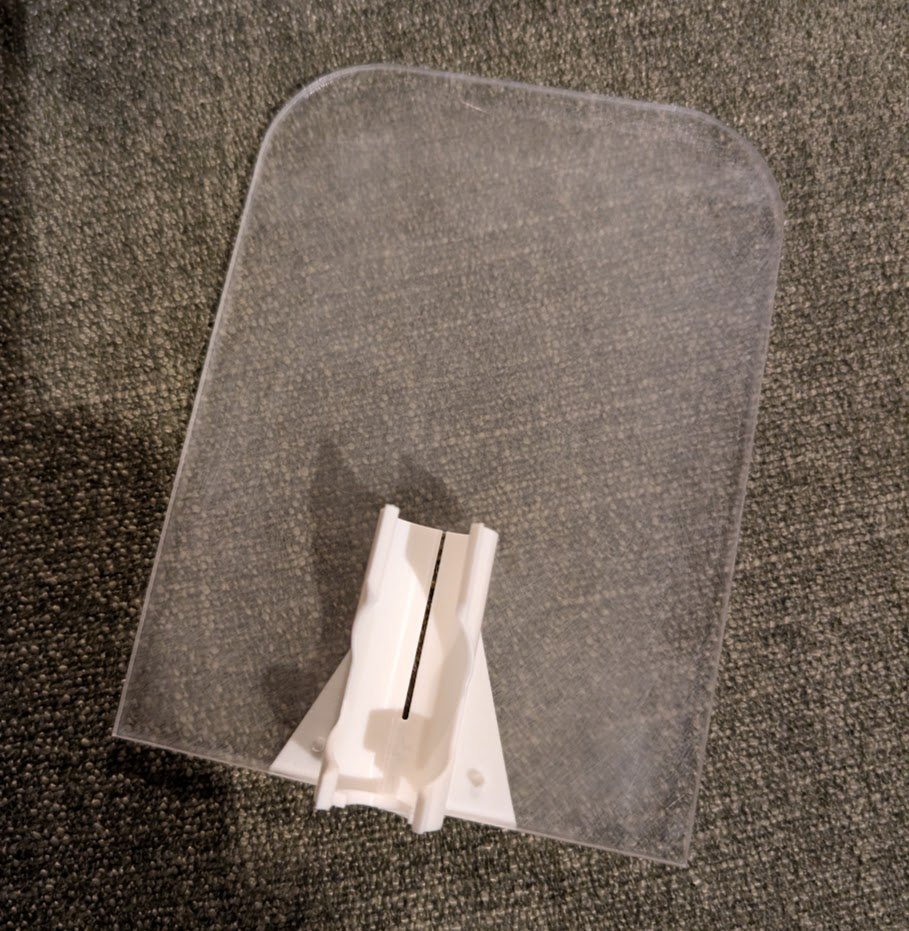
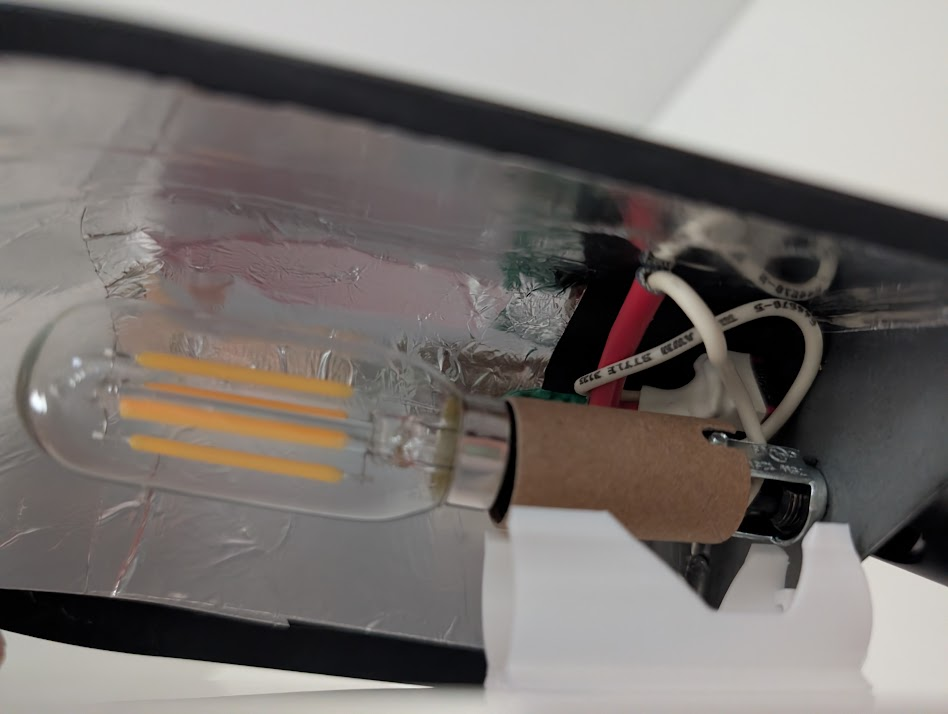
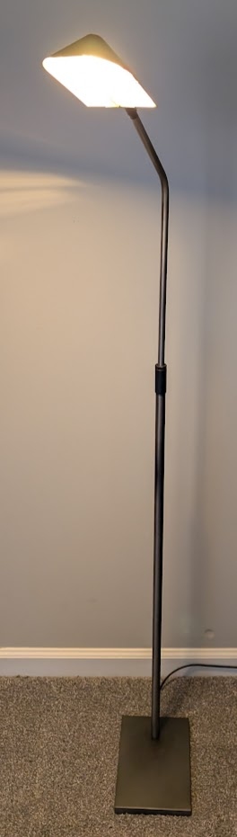
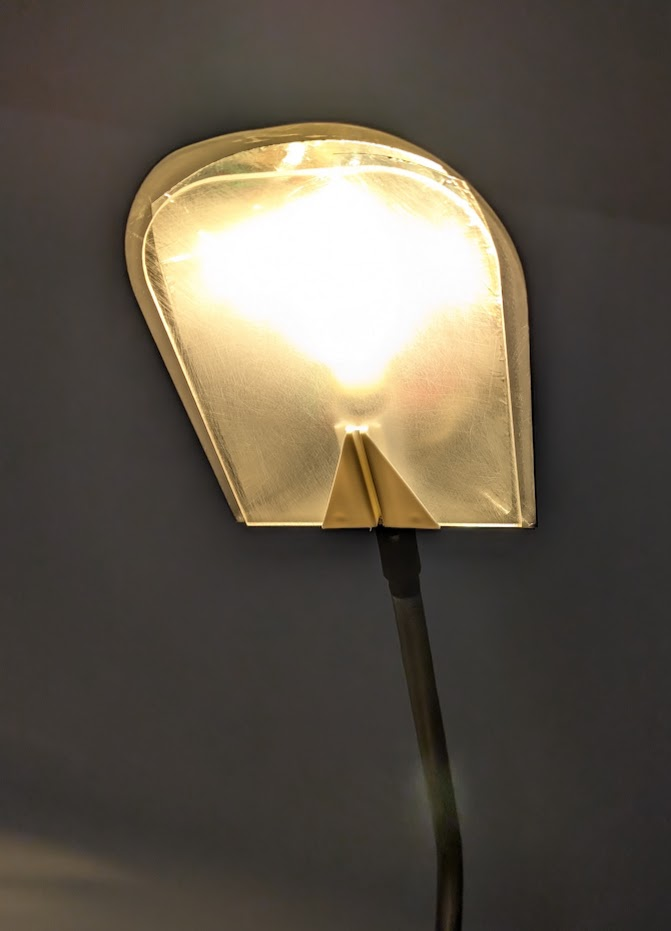

We found a really cool retro antique lamp at an estate sale, and I decided to upgrade it.

I love restoring old electronics, especially light fixtures.

<iframe src="https://www.youtube.com/embed/JSkcCIeSTAU?si=XHK7onY7T_RSTYcZ" title="YouTube video player" frameborder="0" allow="accelerometer; autoplay; clipboard-write; encrypted-media; gyroscope; picture-in-picture; web-share" referrerpolicy="strict-origin-when-cross-origin" allowfullscreen></iframe>

## the lamp

We found it at an estate sale, in probably the weirdest house we've ever seen. Like a 60s drug mansion built around a giant jacuzzi. But the lamp was exactly what we were looking for - a nice posable reading lamp.

The downsides were that it used some very old, specialized bulb, and it got so hot so quickly that you can't really adjust it without burning yourself.

I decided to gut it and make it compatible with a modern LED bulb.

## gutting

I first pulled out the old bulb and cover-plate and snipped off the wires from the old socket. I considered trying to bend or reshape the existing mounting bracket and attach the new bulb fixture to it somehow.

I was also trying to avoid having to cut or re-solder any other wires, aside from the ones that would just screw into the new socket terminals. I decided the best way to secure the new bulb fixture was just to screw it directly in place where the nut for old bracket went, but unfortunately this did mean I had to temporarily cut some wires...

## rewiring

The mounting bracket for the new socket fit perfectly.

I re-soldered the wires, attached the socket, and lined the inside of the lamp with reflective tape.

## new cover

I was planning to laser cut a clear acrylic cover for the housing, and I happened to be heading out to the machine shop soon, so I quickly sketched up an acrylic shape with a slot and holes, and figured I'd come up with a mounting bracket for it later.

The cover plate came out nicely, and I sanded it with 320-grit sandpaper to give it a frosted look. I wanted to hide the guts a little better, and make it a little less harsh on the eyes if you look at it directly.

Took a couple tries, but I 3d-printed something that fit nicely in the acrylic slot and clipped around the base of the socket. It had a wide triangular base to hide the wiring area, with some bumps to lock the acrylic in place.

## finished

