I wanted an invisible version of this plate/book stand, because I wanted to put a clear plate on it, and didn't want to see the stand right through it. The size and shape seemed to fit perfectly otherwise.

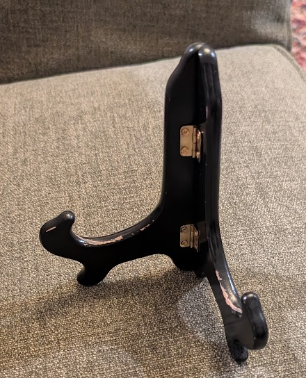

First I scanned it on a flatbed scanner next to a ruler:

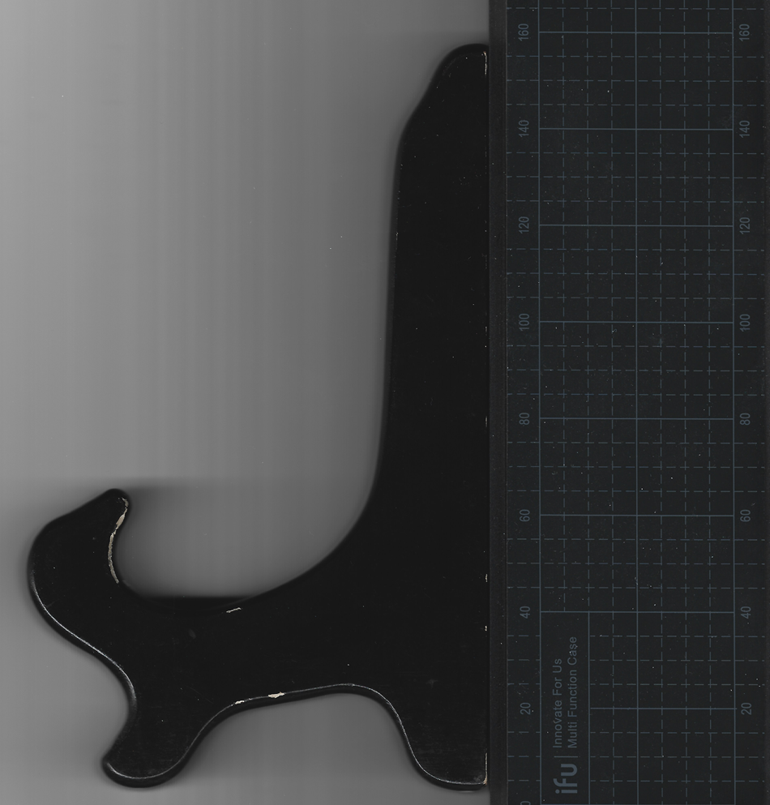

Then I imported it into Autodesk fusion, drew a test line to scale the drawing. Then I traced out a quick rough shape with lines, and just used a bunch of manual filets to smooth the corners to match:

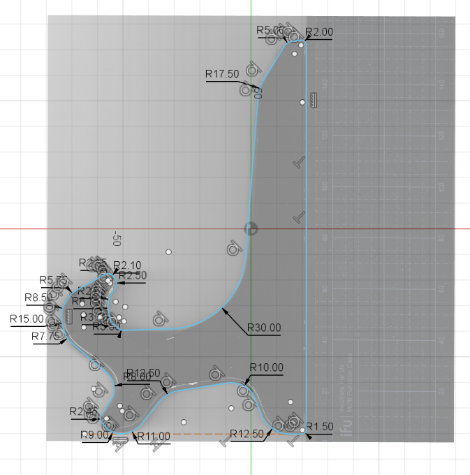

Sketched up a tab, split in two sections, and patterned a copy of it above:

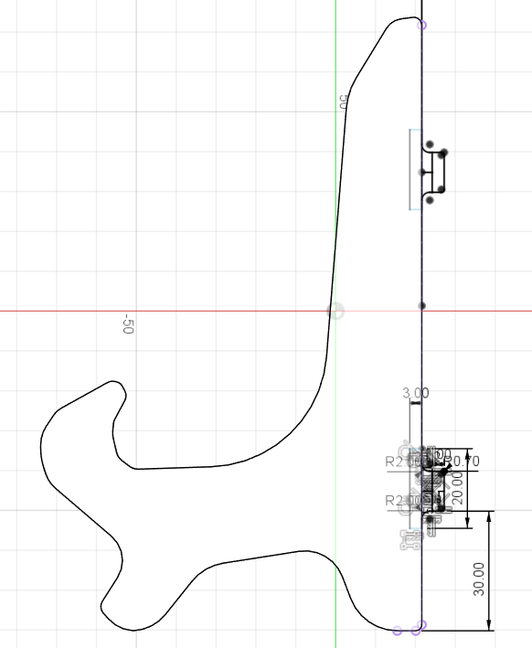

Extruded 1 version of the tabs:

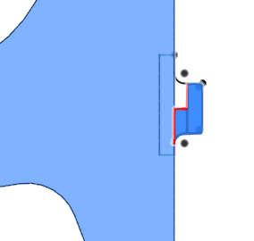

Then suppressed that feature and extruded the other version:

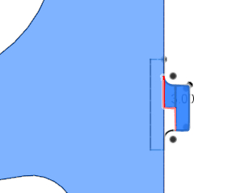

3d preview of how it should look in 3mm acrylic:

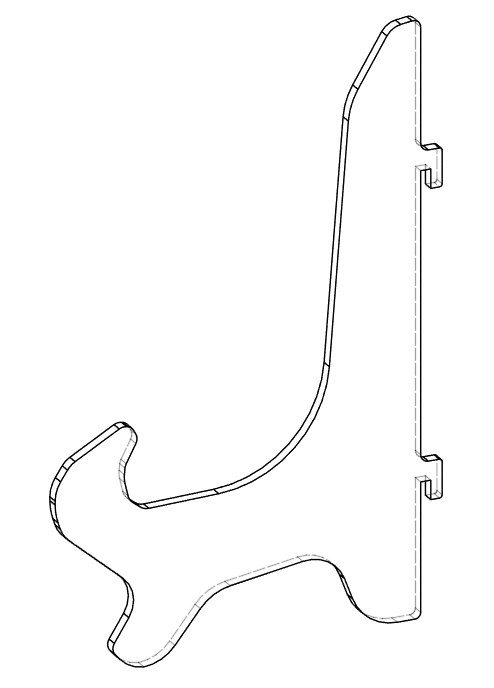

Quickly sketched and cut a calibration piece to get the right snug thickness for the tabs:

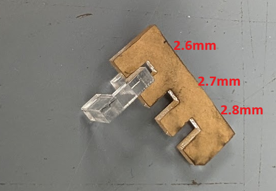

Adjusted the tabs to the final thickness, then exported an SVG of the face for each half, using the autodesk shaper origin plugin. Loaded it into [LightBurn](https://lightburnsoftware.com/) and cut it out with the laser:

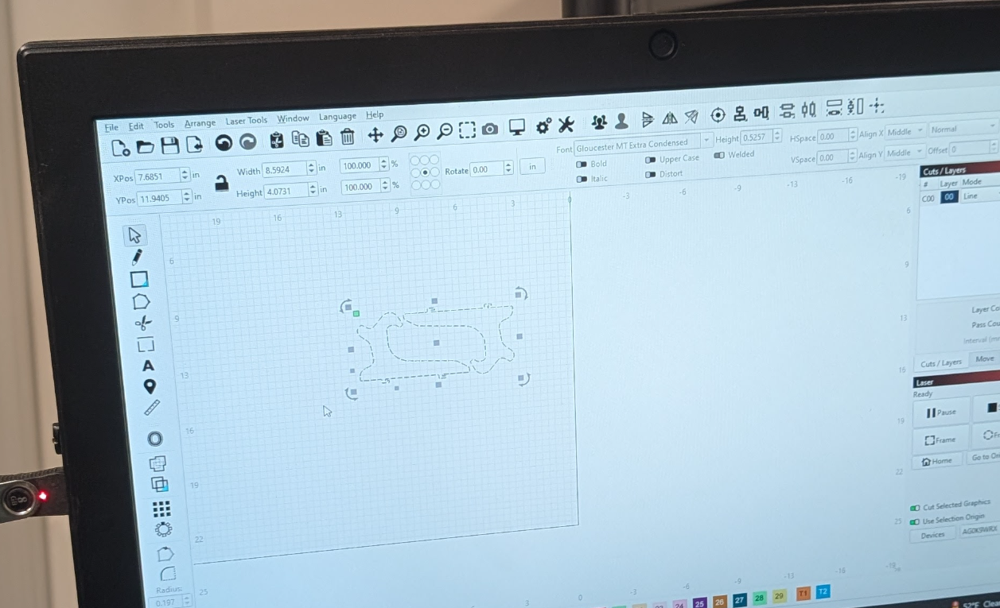

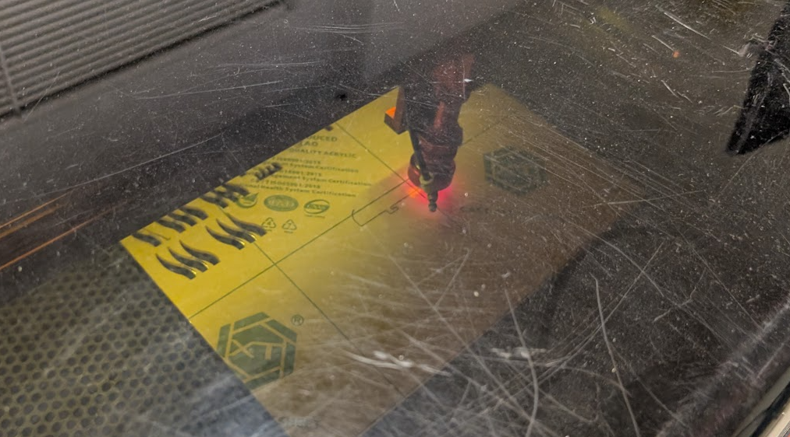

Fits like a glove:

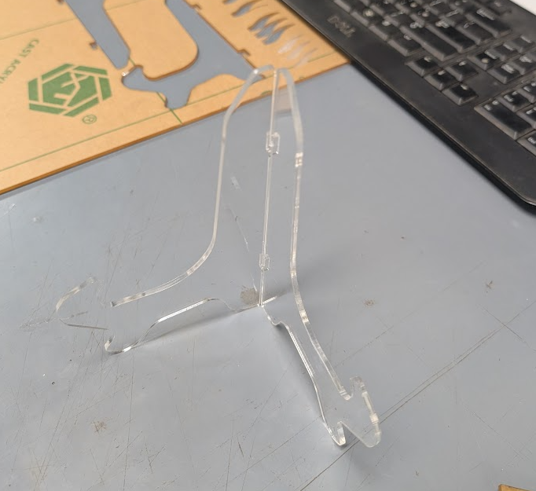

The final product!

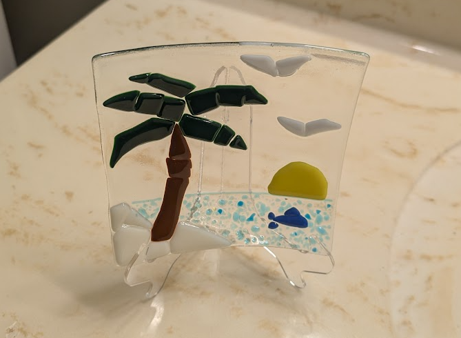
