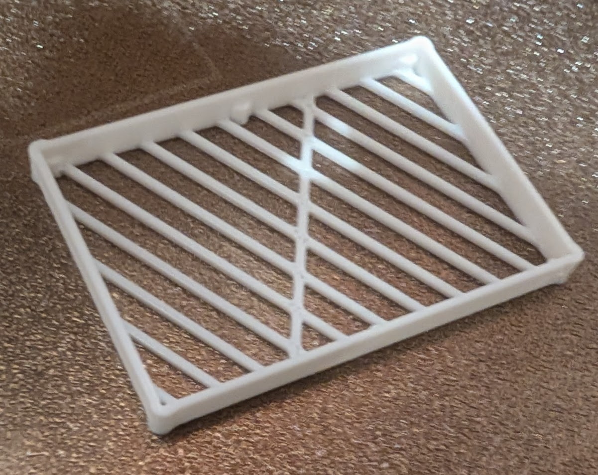
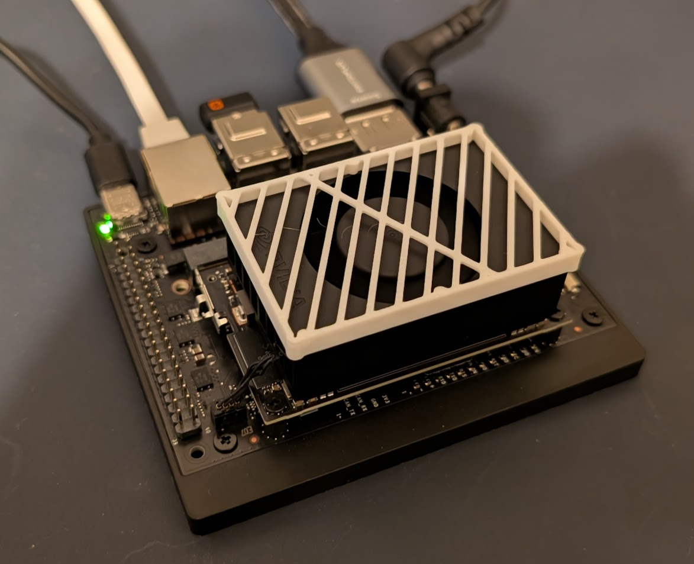

I was working on a project with an Nvidia Jetson Orin Nano, and I kept sticking my finger in the cooling fan by accident, so I decided to see how quickly I could design and print something to fix it...

<!-- cspell:ignore jetson -->

## the problem

The Nvidia Jetson development board has a large, unprotected cooling fan on the top, and it's also the easiest part to grab. So whenever I need to move it I tend to accidentally put my finger on the running fan and I'm worried I'm going to break it.

## the design

I made a really quick line drawing of a box with rounded corners, so it could press fit nicely on top of the fan. I used some minimal cross beams to protect it without impeding airflow too much, and some small bumps to act as standoffs.

With this rounded-corner press-fit method it fit perfectly on the first try.

[Model available on MakerWorld.](https://makerworld.com/en/models/2417128-nvidia-jetson-orin-nano-fan-cover#profileId-2650651)
