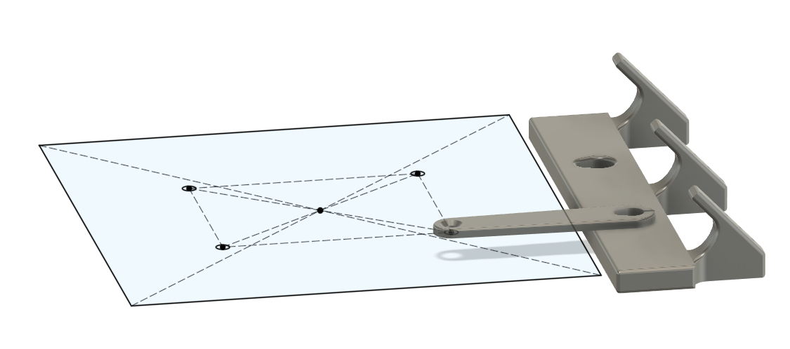
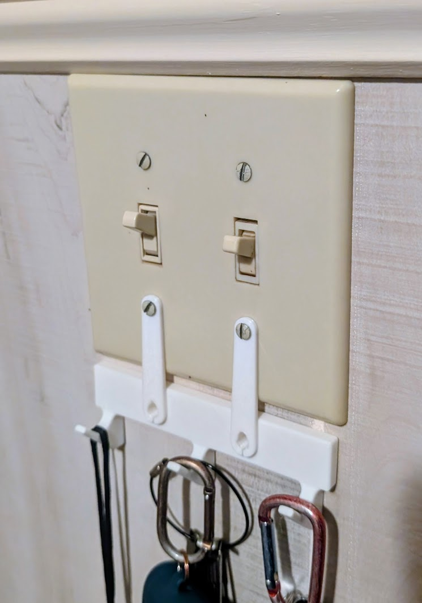

A first draft of a modular design for a wall-mounted key-hook that attaches to a light-switch plate.

## the design

Attaching to a light-switch plate makes it easer to mount without needing any permanent modifications to the wall. And light-switches are usually next to the door and the last thing you reach for on your way out.

I wanted to be able to print without supports, so I avoided overhangs by splitting the design into multiple pieces. This also helped me iterate because I could replace and reattach a new bottom part without having to completely unscrew and remount the connectors. The connectors have a slot to make them slightly flexible for a good press-fit.

Having the hooks hang low below the wall plate, and flush against the wall helps minimize how far they stick out, so they don't get in the way when reaching for the light-switch.

The U-shaped curve helps the keys hang slightly away from the wall, so they're easier to grab.

The final model is available on [MakerWorld](https://makerworld.com/en/models/2208638-light-switch-key-hooks#profileId-2400730).

