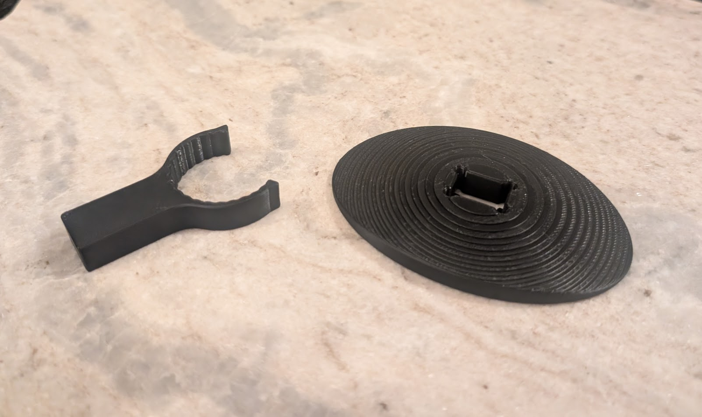
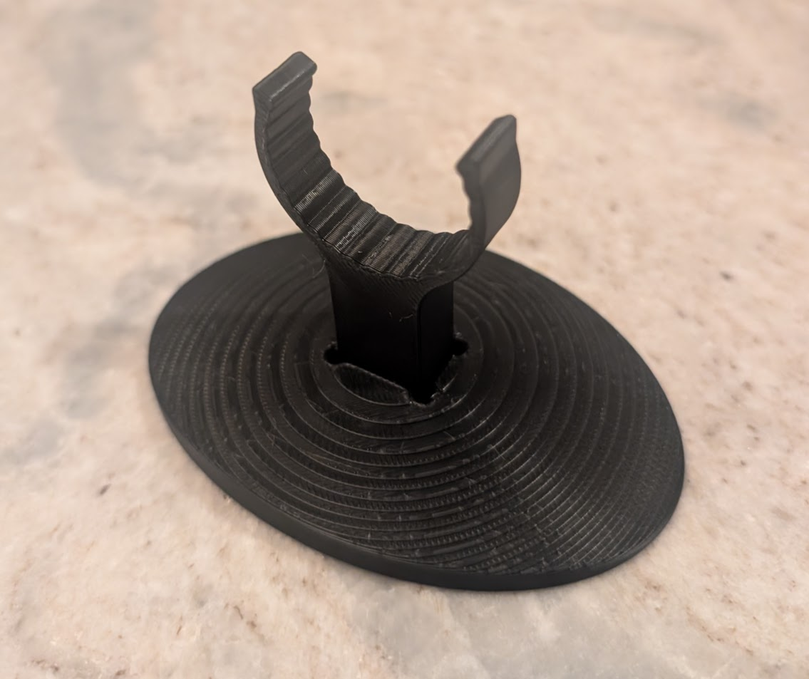
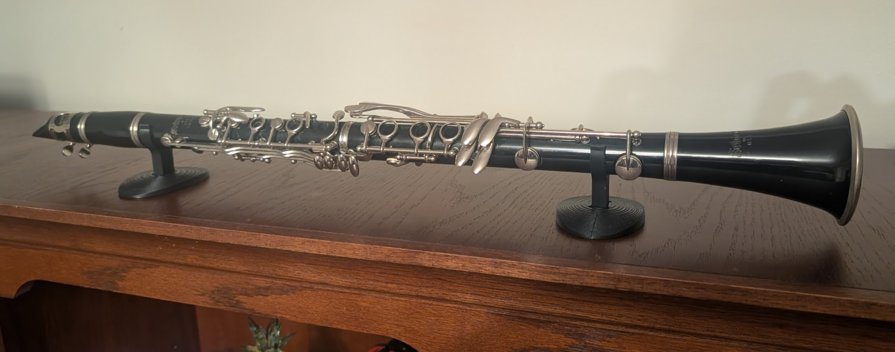

Repurposed an old instrument as a decoration.

## the design

I found my old clarinet from middle school and tried to play it for the first time in 20 years. It didn't sound very good - must be something wrong with the instrument... Anyways, I figured it would make a nice decoration.

*Disclaimer - you're not supposed to leave instruments like this with cork joints constantly assembled - the cork will dry out. Don't do this with an instrument that you ever intend to play again.*

I made a simple modular stand that would hold a 29mm OD clarinet, but have some flexibility to accommodate slightly larger ones as well.

The arms that hold the instrument were printed on their sides, then press fit into the bottom pieces, using some mickey-mouse-ear style cutouts to make a snug fit.

Final assembly:

[Model available on maker-world](https://makerworld.com/en/models/2616709-clarinet-holder-display-stand)
