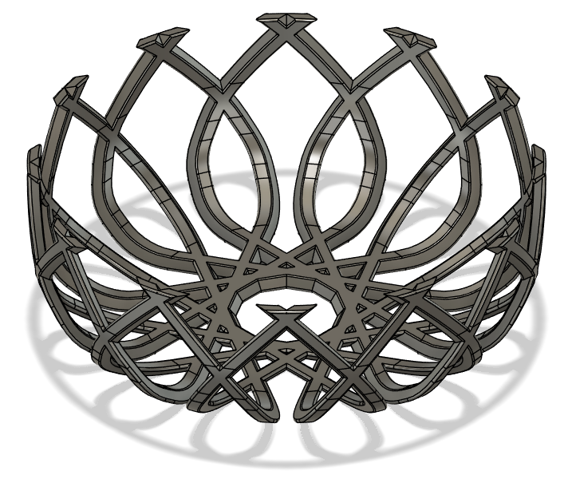
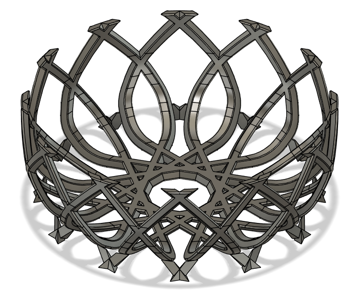
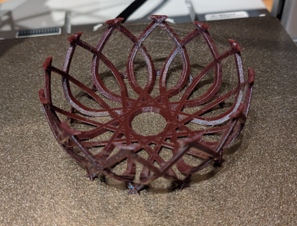
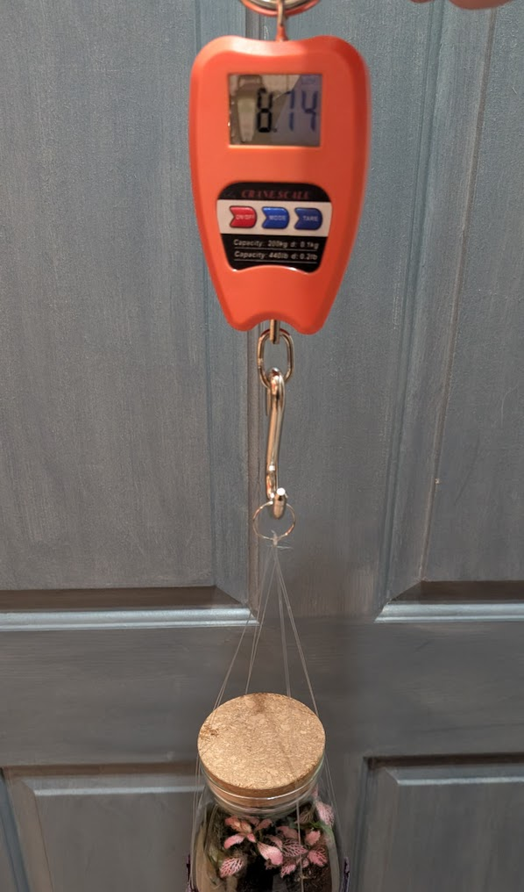
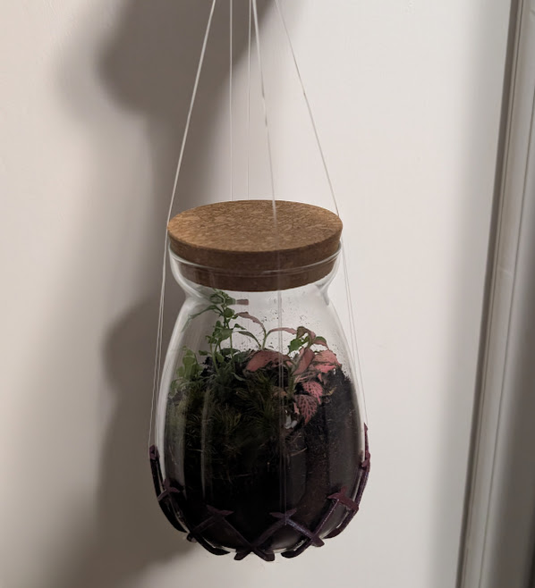

The auto-generated supports from my slicer are sometimes messy and overkill. I decided to try my hand at manually creating my own.

An added benefit to this approach is that everything is included with the model, and you don't have to rely on others to set their slicer settings the same. This can make for more reliable prints when you share a file.

For this project, I wanted to make a little basket to hold this small terrarium, so I could string it up and hang it from the ceiling somewhere.

## modeling and supports

First I modelled the actual thing. I took a picture of the planter straight on and imported that, oriented and scaled it, and traced around it.

Then I modelled the supports; just some tiny shapes around the steeper part of the curve, with a minimal contact to the main body.

## printing

I loaded it into the slicer and stepped through the layers to make sure the supports are actually touching the piece. I ended up having to thicken the top surface slightly.

It printed perfectly, and the supports popped right off easily.

Finally, I wanted to make sure it would actually safely support the weight. I could try to do some complex calculations using material strength and finite-element-analysis... but I just got a cheap luggage scale instead. I weighed the thing it self - just over a pound. And then I pulled on it to an arbitrarily large amount until I got a satisfying reading - over 8 pounds. This gives me a safety factor of about 6, so I'm very satisfied with that.

Now I just have to figure out where I actually want to hang it...

