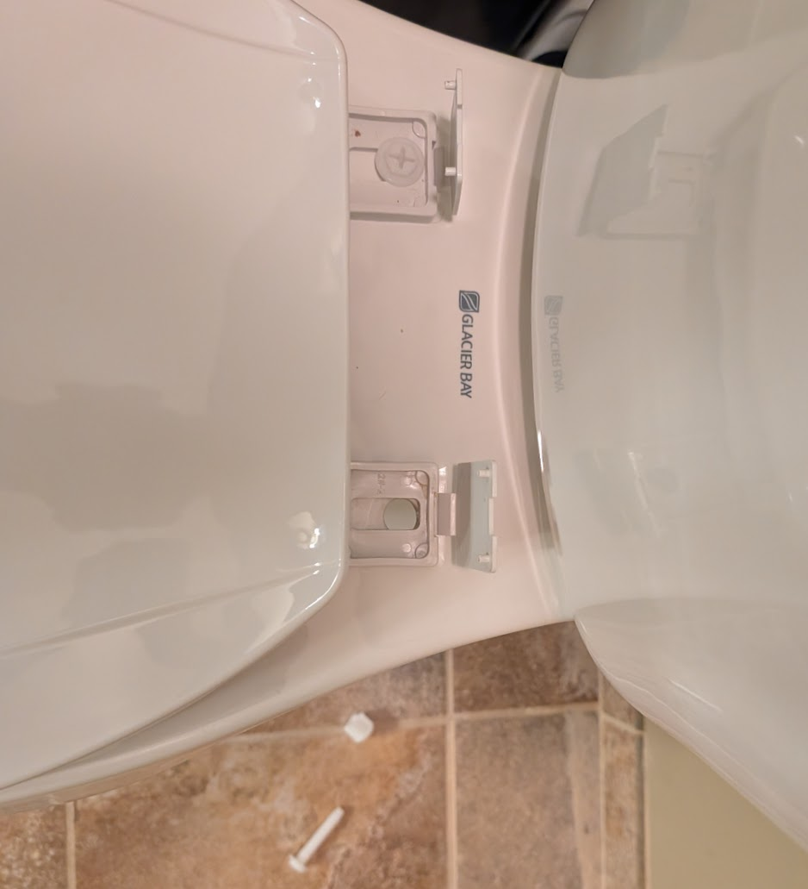
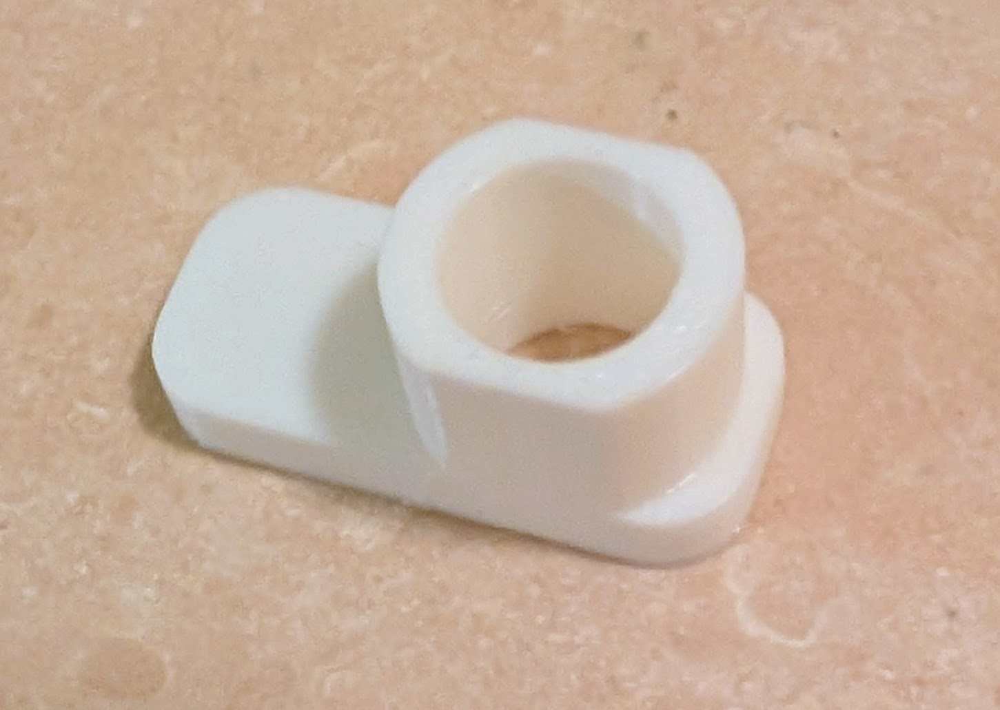
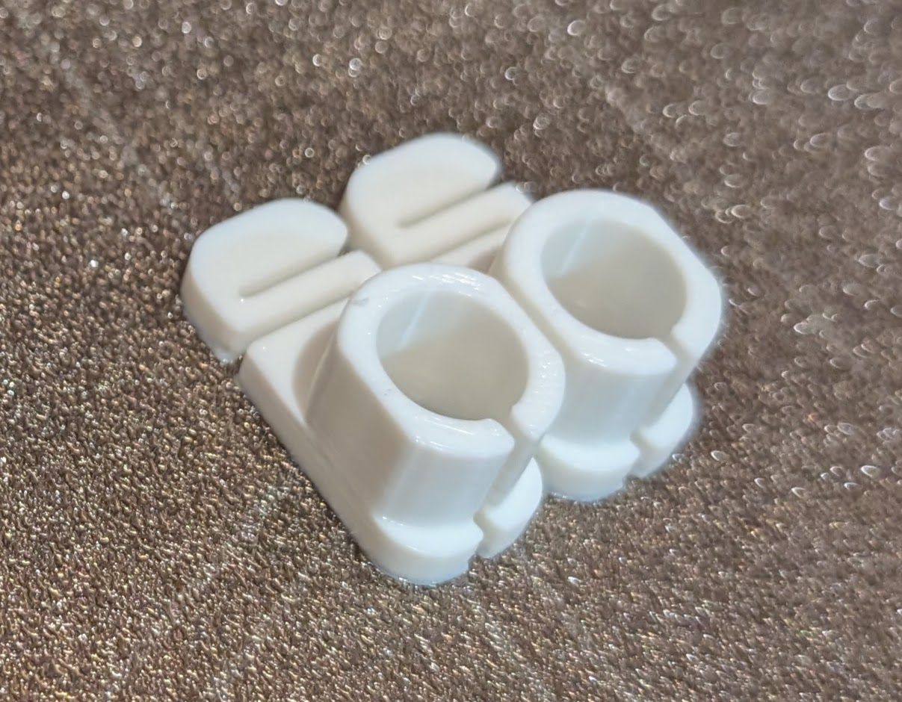
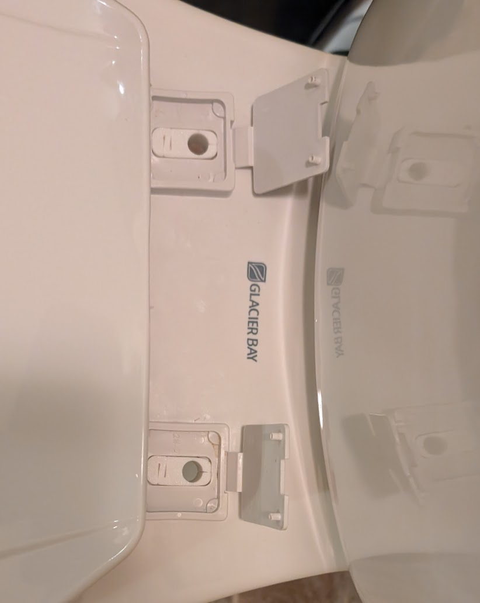

I hate it when the toilet seat slides around, and I hate how it's connected. It's a soft plastic screw and nut, joining a plastic seat to a hard ceramic bowl.

## the problem

The through hole in the ceramic is over-sided, and the toilet seat connector is a wide slot, so there's a lot of room for things to slide around if they're not tight.

The worst part is, if it's not **completely** tight, that's it, it's going to slide, and continue loosening itself. And you can't really tighten it that well because the screw is plastic, and the harder you try, the more you'll damage the screw.

## the solution

I figured maybe I could create some simple bushings to eliminate the sliding, at least when it's mostly tight, so I'd have to re-tighten it less often. Maybe some springiness to absorb the forces on the seat would help prevent it from loosening itself in the fist place.

The first attempt was pretty basic. I found it to be too loose on the top, and too tight on the bottom on one side; the porcelain holes were imperfect and slightly different sizes.

I made it a little bigger and added some cutouts to make it flex and give it a press fit.

Fitting them in place, before putting the screws back in:

Testing it:

<!-- cspell:ignore printables -->

If your house has what I assume is the cheapest toilet and toilet seat at home depot, then this should work for you too. [Model on printables](https://www.printables.com/model/1509321-toilet-seat-bushing).
