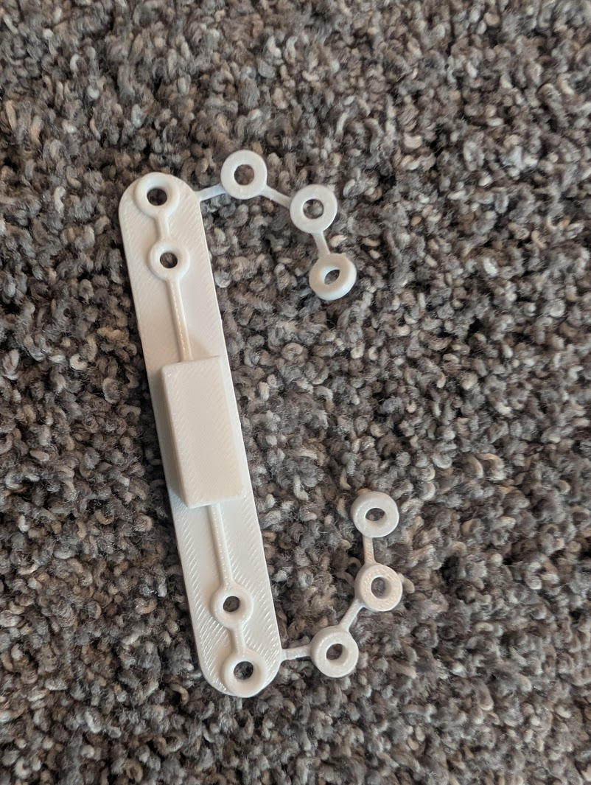
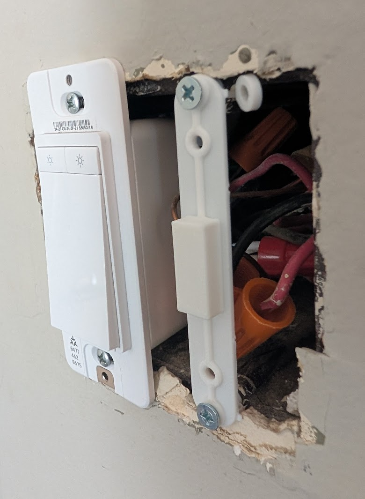
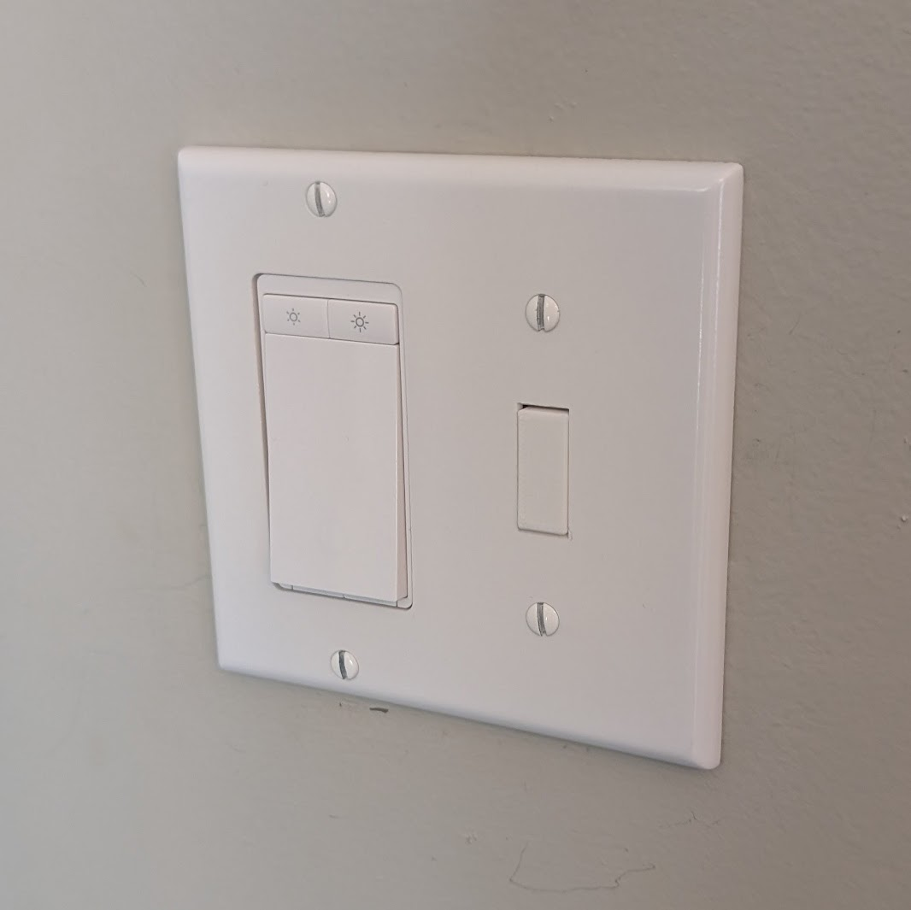

I've been depopulating some light-switches that don't do anything, and I needed something to fill the holes, so I came up with a universal design.

## the design

I made a complicated-looking model really easily using lots of lines and thin-extrudes.

It's a flat panel with a filler for the light-switch hole and standard spacing for the screws. The outer ones are thru-holes, and the inner ones are smaller so they catch the screw threads, so the plate is held in place.

To make it adjustable and account for the depth of the electrical box, I added a set of detachable washers which you can just fold over and stack behind the plate. You can either fold or tuck them inside the box if unused, or just snap them off.

To make it more 3D-printer friendly, I added some small slots on the bottom to decrease warping, and a rounded edge to make it easier to pop off the bed.

I used a printer profile with thicker layers to make it print faster, since only a small portion of the top face is visible and it doesn't require extra strength.

Printed in less than 10 minutes:

Mounting inside the box - I used two on the top and 3 on the bottom:

Covered up:

Model available on [MakerWorld](https://makerworld.com/en/models/2215312-light-switch-blank-filler-with-optional-standoffs#profileId-2408534).
