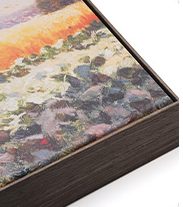
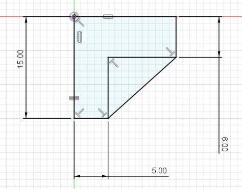
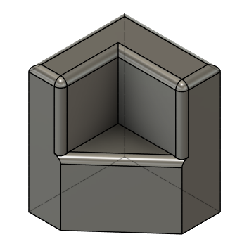
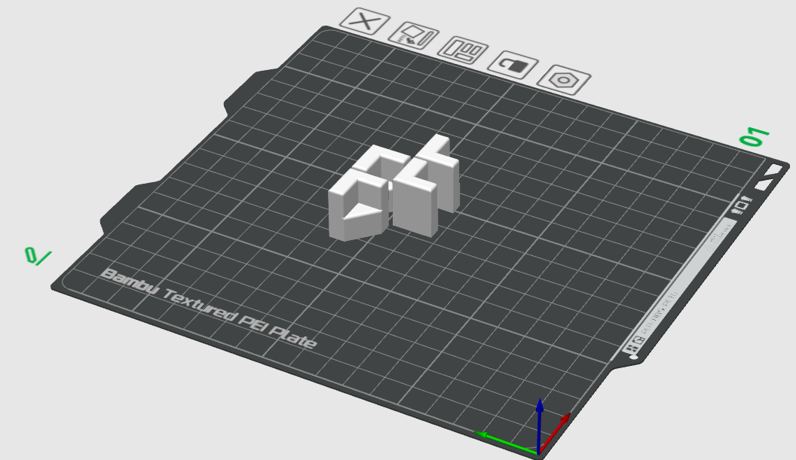
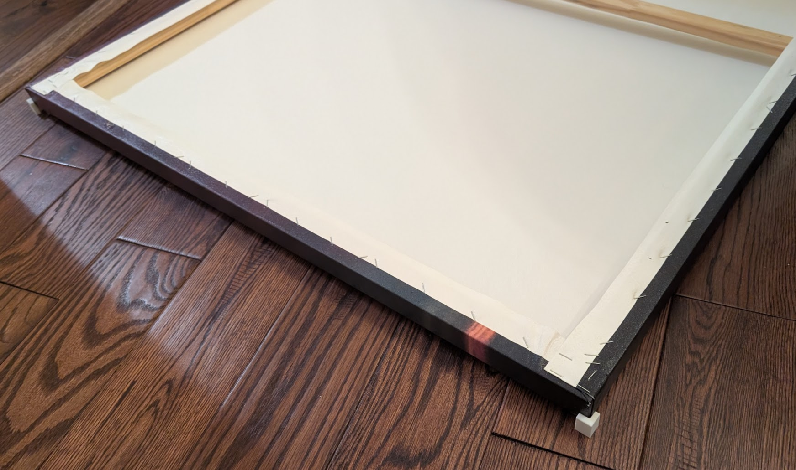
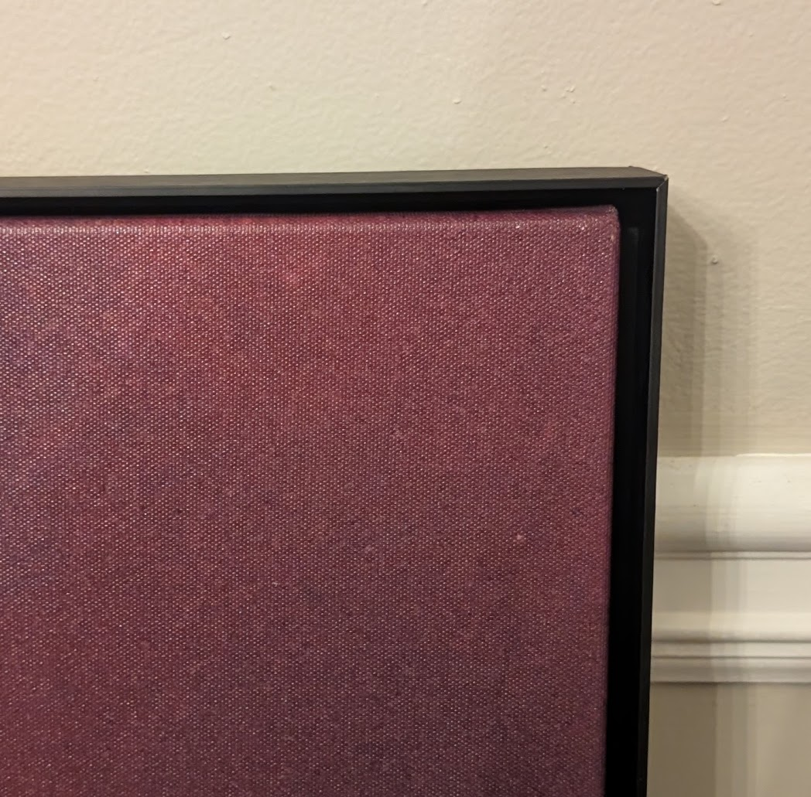

We had a large canvas print on the wall that we wanted to dress up with a [floating metal frame](https://www.amazon.com/dp/B0CFJ3N5DX) like this one:

To simplify the installation and get perfect centering, I decided to 3d-print some quick brackets to hold the picture off the ground and center the frame around it while drilling and screwing it onto the canvas.

Dropped the picture in the frame to measure the overall horizontal and vertical gaps. Made a quick sketch with the two corresponding dimensions:

Then just extruded it deep enough to lift both the canvas and frame off the ground, and rounded off some of the hard edges:

Threw it into the slicer, cloned and mirrored so I'd have one for each corner:

20 minutes later, they were printed, and I dropped my canvas on top of them:

*Probably would have been easier if I'd made them larger and flatter, but it's a throwaway print job so I wanted to be minimal with materials.*

Dropped the frame on top, drilled the holes and screwed it on. Perfect edges all around:

