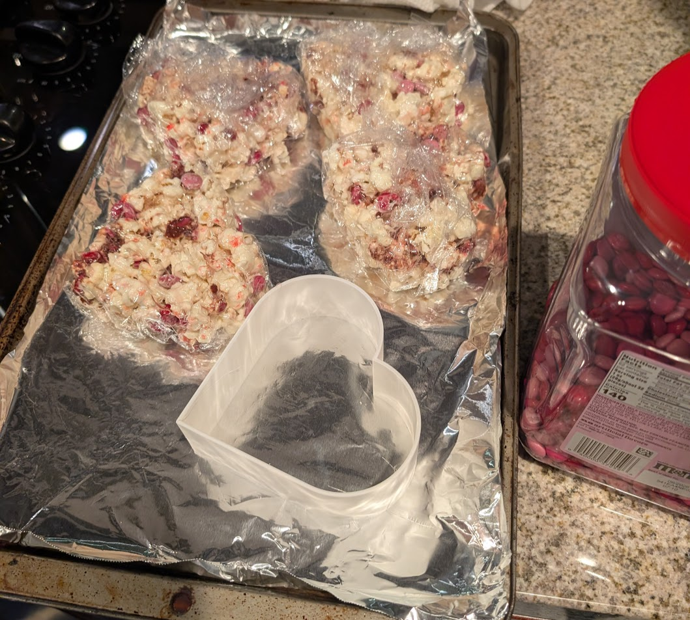

I needed a heart-shaped mold for a valentine's day dessert, and wanted to make something shelf-stable because we were traveling.

## the mold

I drew up a really quick heart-shape in cad - a square and two semi-circles - and did a thin-extrude to make a hollow shape. I tweaked the dimensions to get around 500K mm^3, which is 2 cups. then I started printing it while melting the butter.

I lined the mold with plastic wrap when I was filling in the popcorn, then I just pushed the whole thing through and wrapped it up.

## the recipe - marshmallow popcorn balls

### ingredients

- 1/4 cup butter
- 12 oz bag marshmallows
- ~10 oz bag pre-popped salted popcorn (use pre-popped and you don't have to worry about un-popped kernels)
- optional m&ms, chocolate, etc

### steps

- melt the butter in a pot on low heat
- slowly stir in the marshmallows until melted
- slowly stir in popcorn until evenly coated
- let cool slightly before adding chocolate, etc... or just add this as you're adding the popcorn to the mold, so it doesn't get all melted and mashed up
- then gently scoop and press the mixture into your desired mold

