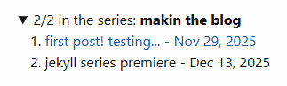

Here we're implementing a series feature in the jekyll blog framework for linking ordered chronological series of posts with a common "series" attribute.

## the goal

I wanted a way to link ordered series of posts, more specific than something like categories but less specific than tags.

Features:

- automatic enabling, for any posts that have the same `series` field in their front-matter, if there's >1 post in the series
- should display that the particular post is number X of a Y part series
- should link to the rest of the series

## implementation

There's probably some existing plugins to do this, but I wanted the fun of doing it myself, and it seemed like it should be simple enough to do all in the frontend with liquid templating code. And I wanted total control of how it worked. For simple things, sometimes it's easier to make something that does exactly what you want than to find something that's kind of close.

Rather than having dedicated series pages, which I'd have to generate programmatically, I'm just going to add an expandible `details` panel near the top of the post layout. I put it in a standalone include file.

At this point the blog is just using a local copy of the basic minima theme, so I can just start modifying things. I added a series_panel.html include file and just include that in the post.html layout.

[see the current code here](https://github.com/r-downing/mk-sth/blob/series/_includes/series_panel.html)

You can see it in action with the collapsible panel above:

> 

Planning to improve the styling later.

## final thoughts

Liquid was a little frustrating to work with; it doesn't have basic functions like finding the index of an item in a list and I had to look up and use special functions even for simple things like basic arithmetic. I'm getting more tempted to switch to a python-based static-site-generator, or make my own...
