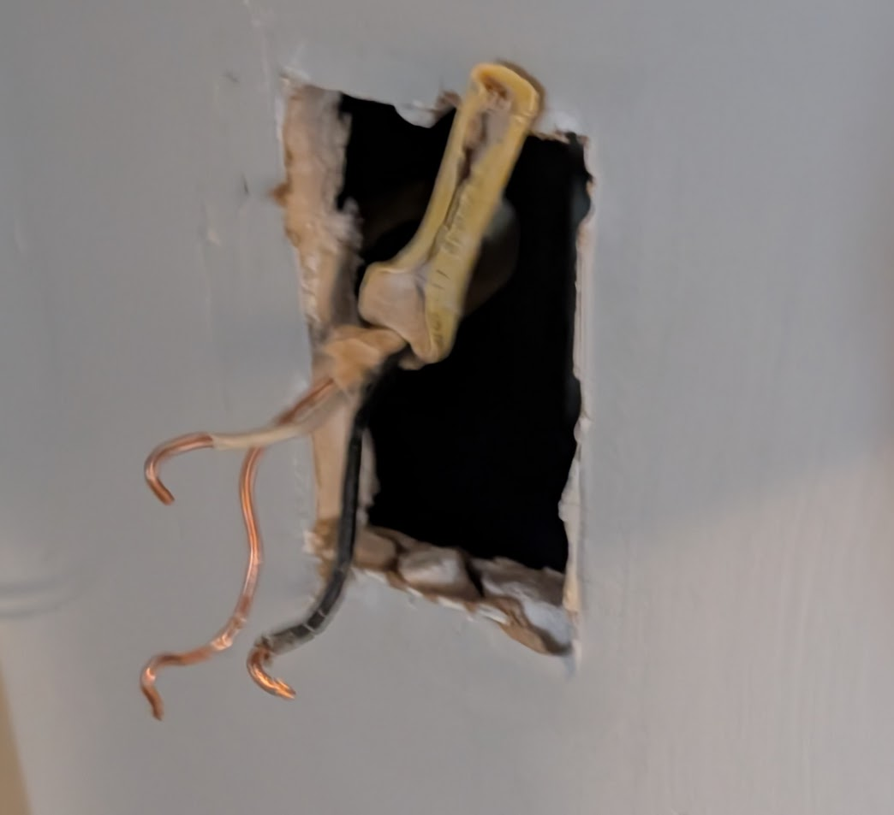
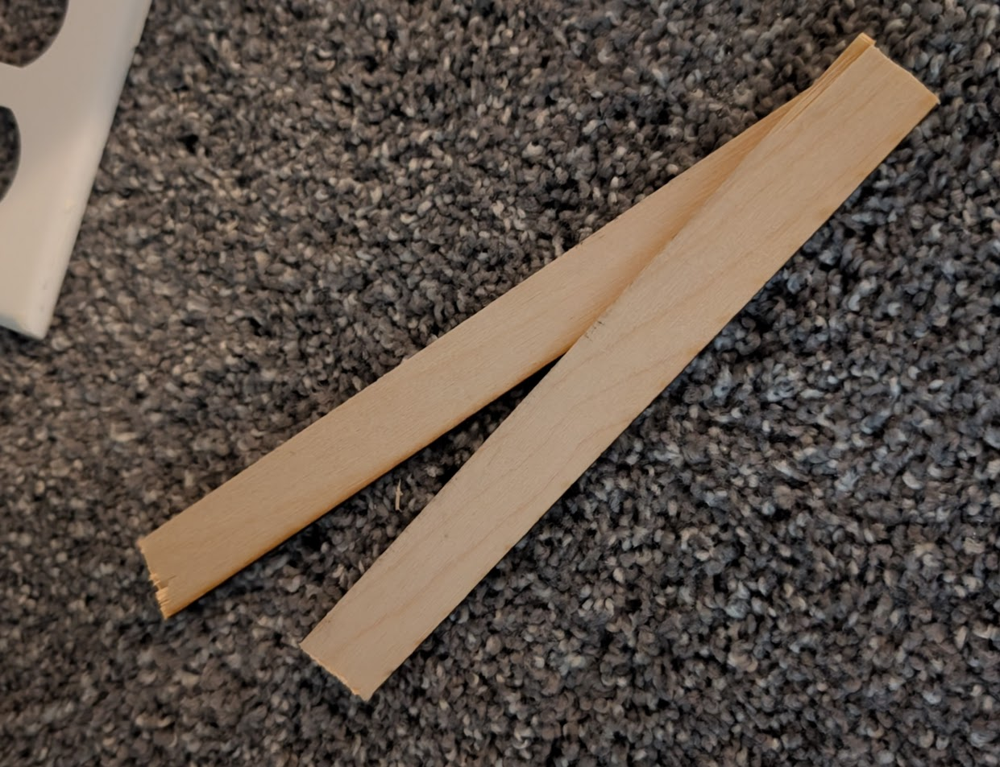
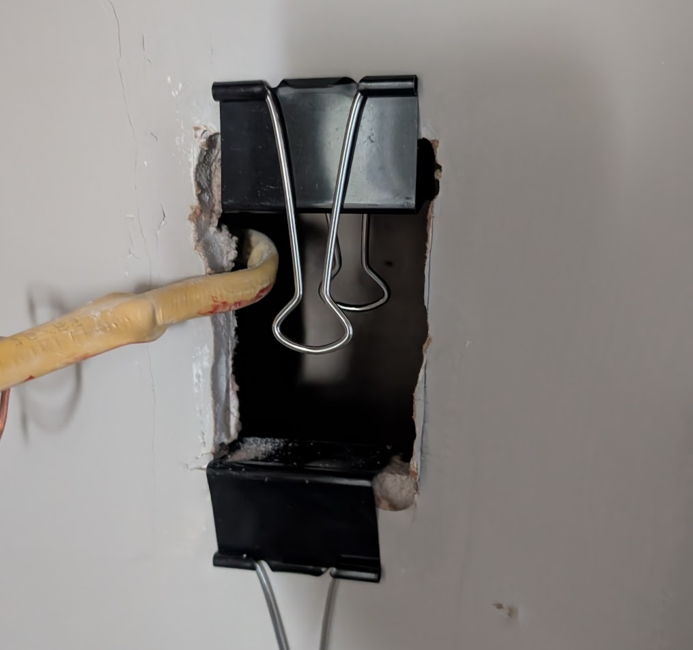
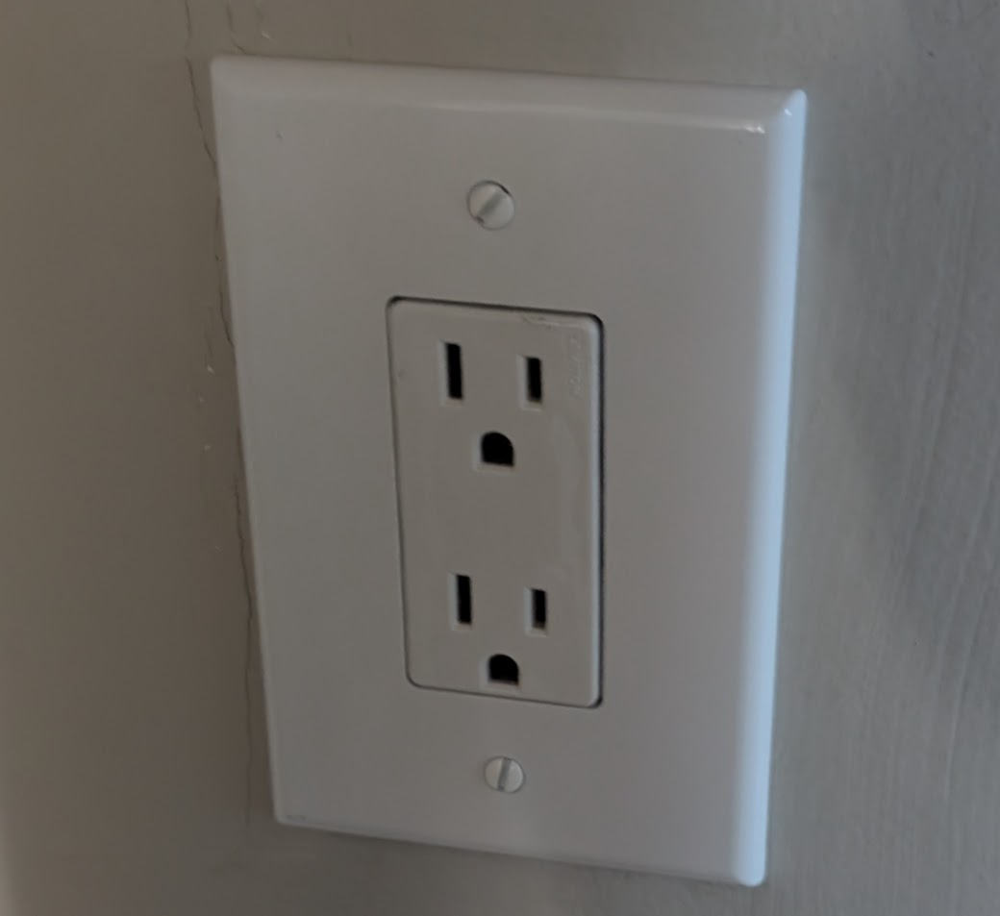

Someone yanked an outlet out of my wall, so I decided to reinforce it before reinstalling.

## the problem

When someone unplugged a cable from my wall, it yanked out the entire electrical box. This was what's called an "old-work" electrical box. Typically new-work boxes are installed in new construction, attached directly to studs, before the drywall is in place. If you want to add an outlet after the fact, you have make a hole through the drywall and use an old-work box, which has extra front screws with wings that pop out to clamp it in place.

The frustrating thing about drywall is that it's just about as strong as a graham-cracker, and it crumbles whenever you touch it... Luckily the edges of this hole weren't too severely damaged, but still compromised.

I wanted to put a little something between the outlet box wings and the inside of the drywall to distribute the force of the clamps and make it stay in place better. Thankfully I had some 1/8" wood leftover from some laser-cutting projects, so I just hacked off a couple long thin strips.

I put glue on them, fed them through the hole (careful not to drop them inside the wall) and just kind of slopped them against the inner face of the drywall, along the bottom and top edges of the hole, where the wings will go. I didn't have clamps small enough so I just used binder clips to keep them in place until the glue dried.

Next day, I pulled out the clips and put in the new box, good as new!

